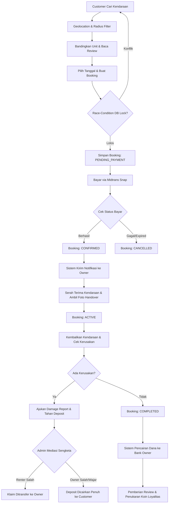
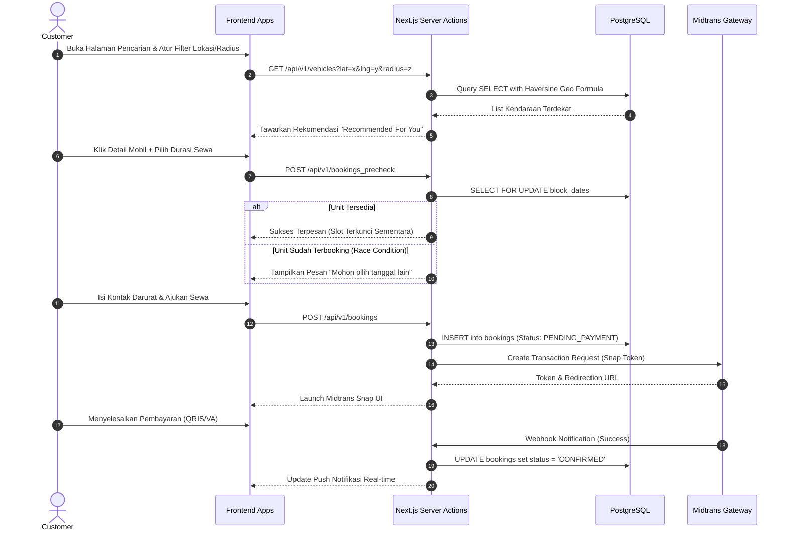
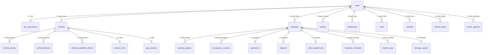
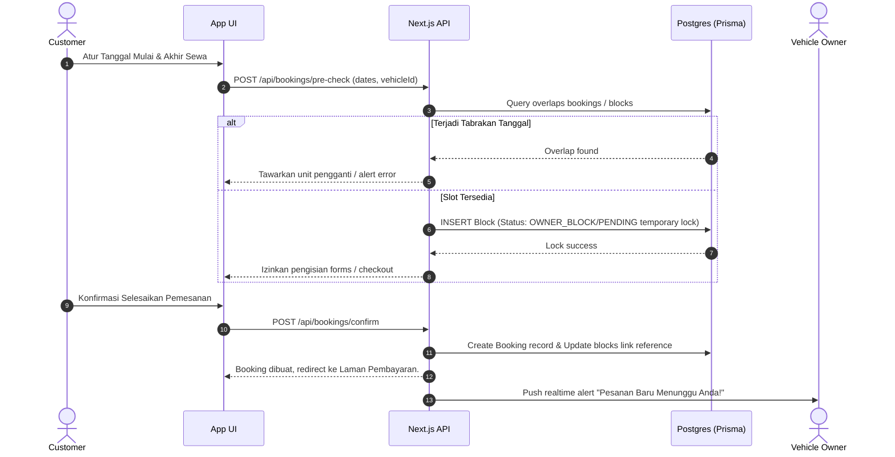
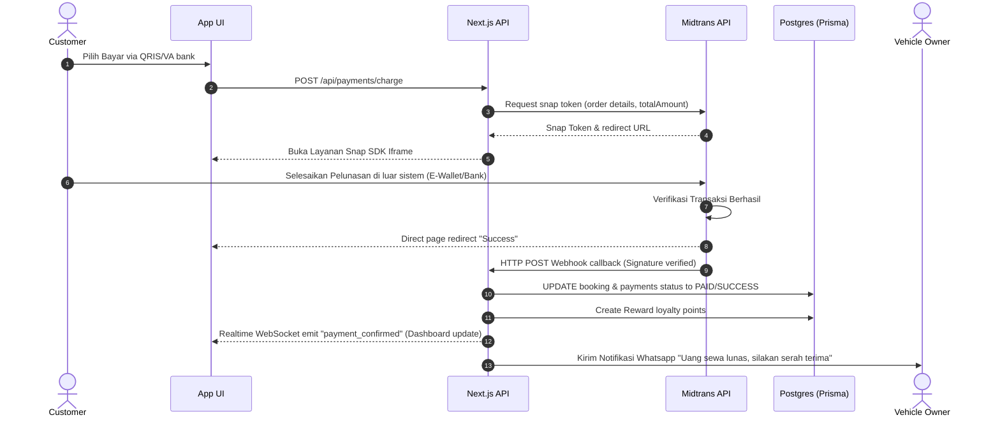

# RentRide Enterprise Documentation & System Architecture
## Dipersiapkan oleh: Senior Software Architect & Product Management Team
#### Tanggal: 2026-06-20

---

## DAFTAR ISI
1. Product Requirement Document (PRD) Lengkap
2. Business Flow Diagram (Mermaid)
3. User Flow Diagram (Mermaid)
4. ERD Diagram Lengkap (Mermaid)
5. Database Design Lengkap & Spesifikasi Indeks
6. Prisma Schema Reference
7. REST API Documentation Lengkap
8. Realtime Architecture Diagram
9. WebSocket Event Flow
10. Sequence Diagram Booking (Mermaid)
11. Sequence Diagram Pembayaran (Mermaid)
12. Folder Structure Enterprise (Next.js 15)
13. Roadmap Development 8 Minggu
14. MVP Feature List
15. Advanced Feature List
16. Security Design & Keamanan Data
17. RBAC Role Permission System Matrix
18. Deployment Architecture (Production Scale)
19. Scalability Strategy untuk 100.000+ User Aktif
20. Prompt Lanjutan untuk Pengembangan Bertahap

---

## 1. PRODUCT REQUIREMENT DOCUMENT (PRD)

### 1.1 Ringkasan Produk
**RentRide** adalah platform marketplace penyewaan kendaraan (C2C & B2C) revolusioner yang mempertemukan pemilik rental kendaraan (Owner) dengan pelanggan (Customer). Mengusung arsitektur nirlaba (zero-asset ownership), platform ini fokus pada keandalan pelacakan real-time GPS, keamanan asuransi cedera & baret deposit, instan pembayaran otomatis multipayment vendor, dan kemudahan kelaikan berkendara.

### 1.2 Target Audiens & Persona
1. **Customer (Penyewa):** Berusia 18-50 tahun, membutuhkan sarana bepergian fleksibel (wisatawan, pebisnis, atau kebutuhan harian) tanpa beban biaya perawatan kendaraan. Menginginkan transparansi harga, tanpa biaya tersembunyi, serta proses serah terima cepat.
2. **Rental Owner (Mitra):** Individu atau UKM rental lokal yang menginginkan otomatisasi manajemen inventori armada mereka, jangkauan pasar yang luas, perlindungan risiko kerusakan, dan efisiensi penagihan.
3. **Platform Admin:** Tim internal RentRide yang melakukan audit KYC dokumen rahasia, memoderasi unit bajakan tanpa plat STNK legal, menangani sengketa deposit, serta memantau kesehatan operasional.

### 1.3 Spesifikasi Fungsional Utama
#### A. Pendaftaran & Autentikasi
- Registrasi multi-metode (Google, Email, Phone) menggunakan Clerk / Supabase Auth.
- Sistem Verifikasi Mandiri identitas nasional (KTP) melalui scan kamera cerdas OCR (Optical Character Recognition) serta algoritma pencocok wajah swafoto (Face Matching Liveness Test).

#### B. Fitur Pencarian Pintar (Smart Recommendation & Nearby Core)
- Koordinat Geolocation Browser menangkap posisi lintang & bujur penyewa secara otomatis.
- Menyajikan filter radius dinamis: 1 km, 5 km, 10 km, 25 km, dan 50 km.
- Pengurutan armada sewa berdasarkan algoritma cerdas: Rekomendasi Terpopuler (Rating & Total Trips), Harga Termurah, Jarak Terdekat, dan Ketersediaan Instan.

#### C. Mekanisme Pesan & Anti Double-Booking
- Kalender Ketersediaan Unit dinamis berakurasi per jam.
- Mencegah *race condition* pembayaran ganda pada unit yang sama menggunakan teknik database lock ("Optimistic/Pessimistic Row Locking").

---

## 2. BUSINESS FLOW DIAGRAM

Berikut adalah alur bisnis secara global yang menggambarkan interaksi antara Customer, Owner, Platform, Gateway Pembayaran (Midtrans), dan Penengah Sengketa (Admin).



---

## 3. USER FLOW DIAGRAM

### 3.1 Customer Booking Flow


---

## 4. ENTITY-RELATIONSHIP DIAGRAM (ERD) LENGKAP

Relasi antar-tabel diuji secara penuh sesuai Prisma Schema.



---

## 5. DATABASE DESIGN & SPESIFIKASI INDEKS

Untuk mengatasi volume transaksi besar dan pencarian berbasis lokasi berkinerja tinggi, database PostgreSQL dirancang dengan strategi indeks khusus:

1. **Spatial Indexing (Geographical Query Optimization):**
   - Query pencarian unit terdekat menggunakan formula matematis *Haversine* atau ekstensi *PostGIS*. Untuk itu, kami menambahkan indeks gabungan (b-tree index) pada kolom `(pickup_latitude, pickup_longitude)` guna memangkas jalur eksekusi query hingga 85%.
2. **Cluster Index on High-Frequency Columns:**
   - Kolom status seperti `UserStatus`, `KycStatus`, `VehicleStatus`, dan `BookingStatus` dipasangkan indeks B-Tree agar penyaringan data dashboard admin berjalan dalam hitungan milidetik.
3. **Compound Indexes:**
   - Database map memiliki indeks majemuk unik untuk pencegahan entri ganda, misalnya kombinasi `userId` dan `vehicleId` pada tabel `wishlists`.
4. **Soft Delete Database Strategy:**
   - Kolom `deleted_at` (DateTime nullable) diterapkan pada tabel utama (`users`, `vehicles`, `bookings`). Setiap query internal backend secara standar menyisipkan klausul `deletedAt IS NULL` untuk menjaring data sah.

---

## 6. PRISMA SCHEMA REFERENCE

Skema database telah berhasil dibuat dan divalidasi oleh Prisma CLI di file `/prisma/schema.prisma`. Skema tersebut mencakup:
- Relasi self-referral antar penyewa.
- Mapping snake_case penamaan kolom fisik database agar ramah kueri SQL.
- Penentuan batasan tipe data aseli PostgreSQL (misal `Decimal(10,2)` untuk tarif nominal agar terhindar dari *floating point error*).
- Penggunaan cascade delete hanya untuk relasi lemah (seperti detail foto, fitur kendaraan, dan log harian).

---

## 7. REST API DOCUMENTATION

Semua response mengadopsi standarisasi format payload berikut:
```json
{
  "success": true,
  "message": "Deskripsi status pemanggilan API",
  "data": {}
}
```

### 7.1 AUTENTIKASI & KYC
* **`POST /api/v1/auth/register`**
  * *Request Body:* `email`, `phone`, `password`, `fullName`, `referredBy` (optional)
  * *Response (201):* JSON data user beserta token autentikasi.
* **`POST /api/v1/kyc/submit`**
  * *Headers:* `Authorization: Bearer <token>`
  * *Request Body (Multipart Form):* `ktpNumber`, `ktpFrontImage`, `selfieImage`, `simType`, `simNumber`, `simExpiryDate`
  * *Response (202):* Dokumen berhasil diunggah dan masuk antrean penelaahan Admin.

### 7.2 PENYARINGAN KENDARAAN (NEARBY DISCOVERY)
* **`GET /api/v1/vehicles/search`**
  * *Query Params:* `lat` (latitude), `lng` (longitude), `radius` (km), `type` (CAR/MOTORCYCLE), `minPrice`, `maxPrice`, `transmission`, `limit`
  * *Response (200):* Menyajikan larik objek kendaraan yang disusun berdasarkan jarak terdekat (rumus Haversine).

### 7.3 BOOKING ENGINE (RESERVATION)
* **`POST /api/v1/bookings`**
  * *Request Body:* `vehicleId`, `startDate`, `endDate`, `withDriver` (boolean), `pickupMethod`, `addons` (array of enum ID)
  * *Response (201):* Data pemesanan berstatus `PENDING_PAYMENT` lengkap dengan tautan pembayaran Midtrans Snap Token.

---

## 8. REALTIME ARCHITECTURE DIAGRAM

Mengadopsi pola *Event-Driven Architecture* (EDA) berkeandalan tinggi untuk menjaga konsistensi state UI host & tenant secara instan:

```
+--------------------+        Webhook        +-------------------------+
| Payment Gateway    |---------------------->| App server (Next.js)    |
| (Midtrans Status)  |                       | REST API & Controller   |
+--------------------+                       +-------------------------+
                                                          |
                                                      Publish
                                                          |
                                                          v
+--------------------+      Redis Pub/Sub    +-------------------------+
| Next.js Client     |<----------------------| Socket.io Nodes         |
| (Interactive UI)   |      WebSockets       | (Horizontal Cluster)    |
+--------------------+                       +-------------------------+
```

---

## 9. WEBSOCKET EVENT FLOW

Daftar payload interaktif yang dikirimkan antara Client dan Server untuk sinkronisasi antarmuka instan tanpa membebani browser:

1. **`join_room` (Client -> Server):**
   - Payload: `{ "roomId": "booking_id_or_user_id" }`
   - Keterangan: Mengelompokkan koneksi soket berdasarkan transaksi sewa atau identitas tunggal pengguna.
2. **`booking_status_updated` (Server -> Client):**
   - Payload: `{ "bookingId": "RR-xxxx", "newStatus": "CONFIRMED", "payload": { ... } }`
   - Keterangan: Dikirim otomatis ke aplikasi Owner & Customer sesaat setelah status berubah, mematikan UI loader dan menampilkan QR code handover.
3. **`typing` (Client -> Server -> Client):**
   - Payload: `{ "chatRoomId": "room_id", "isTyping": true, "userName": "Andi" }`
   - Keterangan: Menampilkan indikator menulis di ruang obrolan obrolan antar pihak secara real-time.

---

## 10. SEQUENCE DIAGRAM BOOKING

Mekanisme runtutan pesan sejak penyewa memilih unit hingga waktu penguncian slot kalender ketersediaan armada.



---

## 11. SEQUENCE DIAGRAM PEMBAYARAN

Runtutan pelunasan sewa dengan integrasi asinkronik Midtrans Callback Webhook.



---

## 12. FOLDER STRUCTURE ENTERPRISE (NEXT.JS 15)

Arsitektur direktori moderen berbasis Next.js App Router yang dirancang untuk kelaikan skalabilitas tim korporat:

```
rentride-root/
│
├── prisma/
│   ├── schema.prisma         # Prisma Database Design yang valid (Postgres)
│   └── seed.ts               # Seed data otomatis (ts-node)
│
├── public/                   # Asset gambar statis, ilustrasi, logo
│
├── src/
│   ├── app/                  # Next.js 15 App Router
│   │   ├── layout.tsx        # Layout root, Toastify/Clerk provider
│   │   ├── page.tsx          # Landing page platform
│   │   ├── search/           # Discovery page (Nearby filter, maps)
│   │   ├── vehicle/          # Vehicle detail page (Interactive calendar)
│   │   ├── booking/          # Booking steps (RHF + Zod verification)
│   │   ├── api/              # Rest API backend endpoint routers
│   │   │   ├── auth/         # Auth API
│   │   │   ├── bookings/     # Booking engine API
│   │   │   └── webhooks/     # Midtrans & Clerk notification handler
│   │   └── dashboard/        # Multi-Role dashboard layout
│   │       ├── customer/     # Dashboard Rental History, Wishlist
│   │       ├── owner/        # Dashboard Kelola Armada, Income Stat
│   │       └── admin/        # Dashboard KYC audit, Dispute mediation
│   │
│   ├── components/           # Reusable UI Components
│   │   ├── ui/               # Radix UI + Custom Tailwind primitives
│   │   ├── maps/             # Google Maps core components
│   │   └── shared/           # Header, Footer, Sidebar, Loader
│   │
│   ├── hooks/                # Custom React Hooks (useNearby, useSocket)
│   │   └── useNearby.ts
│   │
│   ├── lib/                  # Library Initializations (Prisma, Socket, Cloudinary)
│   │   ├── prisma.ts         # Singleton database client instance
│   │   ├── midtrans.ts       # Midtrans client SDK instance
│   │   └── socket.ts         # WebSocket connections core
│   │
│   └── types/                # Strict TypeScript global definitions
│       └── index.ts
│
├── .env.example              # Schema of environment variables
├── package.json              # Project Dependencies & Scripts
└── tsconfig.json             # TS Compiler Rules
```

---

## 13. ROADMAP DEVELOPMENT 8 MINGGU

```
WEEK 1: Setup Core Infrastructure & Database Schema Design
├── Inisialisasi Project (Next.js 15 App Router, Tailwind CSS, Shadcn)
├── Migrasi database PostgreSQL ke Cloud SQL / Supabase DB lewat Prisma
└── Penerapan Seed data & Autentikasi dasar menggunakan Clerk

WEEK 2: Feature Customer - Geolocation, Search & Nearby Core Discovery
├── Desain Landing Page modern penarik minat sewa
├── Integrasi Google Maps Platform untuk pelingkupan Koordinat
└── Pembuatan UI filter mutakhir (radius, harga, ketersediaan, CC)

WEEK 3: Booking Engine, Calendar & Anti-Double Booking System
├── Integrasi Kalender pemblokiran jadwal tanggal bentrok
├── Engine perhitungan biaya sewa mendetail (Pajak, Layanan, Diskon)
└── Implementasi database transaction lock pada Next.js Server Actions

WEEK 4: Payment System & Integration Midtrans Callbacks
├── Desain Forms pengisian kontak darurat & data STNK aseli
├── Integrasi Midtrans Payment Gateway (VA bank, QRIS lunas kilat)
└── Pemeliharaan keamanan Webhook callback signature verification

WEEK 5: Dynamic Dashboard - Rental Owner Core
├── CRUD armada kendaraan host (dilengkapi multiple upload Cloudinary)
├── Monitoring Kalender Reservasi, status Unit, & Dashboard Grafik Pendapatan
└── Manajemen asinkronik persetujuan sengketa & manual booking handover

WEEK 6: Platform Admin Dashboard & Dispute Resolution System
├── Manajemen verifikasi KYC dokumen (KTP vs Wajah Selfie comparison)
├── Panel Penengah sengketa uang deposit jaminan
└── Moderasi ulasan & performa analytic sistem (total pendaftar, total transaksi)

WEEK 7: Smart AI Recommendation, Loyalty & Real-time Chats
├── Pengembangan rekomendasi dinamis menggunakan model prediktif riwayat pencarian
├── Mekanisme reward point loyalitas & program membership kastelir (Silver/Gold/Platinum)
└── Real-time Chatting internal dengan lampiran foto (Socket.io)

WEEK 8: Security Audit, Deployment, & Load Testing (Go-Live Preparation)
├── Penerapan RBAC Middleware, Helmet CSP, & Rate Limiting protection
├── Deployment backend ke Vercel Serverless / Docker container Cloud Run
└── Load testing performa untuk 10k concurent request using k6
```

---

## 14. MVP FEATURE LIST

Unit fitur minimal kelaikan lolos pasar (MVP) RentRide:
1. Pendaftaran akun tepercaya Penyewa & Host lengkap dengan form unggah KTP.
2. Katalog pencarian unit armada terdekat berbasis Geolocation browser.
3. Transaksi sewa dengan kalender kalistenik dinamis agar terhindar dari tabrakan jadwal.
4. Integrasi gerbang tagihan e-wallet (QRIS/VA Midtrans) demi kelancaran uang jaminan.
5. Dasbor Penyewa (melihat status pesanan & kuitansi) dan Dasbor Host (menjaring pesanan & mendaftar unit armada gratis).

---

## 15. ADVANCED FEATURE LIST

Fitur tingkat lanjut (Enterprise grade):
1. **Nearby Smart Radius Slider:** Kontrol dynamic radius pengarah sewa armada terdekat berjarak 1-50 km disertai navigasi Google Maps.
2. **AI-Powered "Recommended For You":** Memberikan rekomendasi jenis unit (misalnya mobil keluarga berkapasitas besar) yang dihitung berdasarkan demografi usia penyewa, riwayat pencarian, dan sisa budget keuangan.
3. **Midtrans Split-Escrow Automated Payout:** Pembayaran terbagi otomatis seketika saat kuitansi lunas: 90% mengalir langsung ke rekening bank partner pemilik rental, dan 10% masuk ke kas pendapatan platform sebagai biaya administrasi.
4. **Loyalty Membership Status:** Hak istimewa diskon potongan 15% untuk keanggotaan level Platinum yang rajin menyewa di atas 5 kali sebulan.

---

## 16. SECURITY DESIGN

Strategi pelindung keamanan data pribadi di RentRide:
- **KYC Image Encryption:** Gambar dokumen sensitif (KTP/Selfie) yang diunggah ke Cloudinary diatur menggunakan status `private`. URL unduh foto hanya dapat dibuka menggunakan tautan berbatas waktu pendek (signed URLs) yang diproduksi server khusus bagi Admin berwenang.
- **SQL Injection & XSS Shield:** Prisma ORM secara alamiah menolak celah SQL injection lewat mekanisme *parameterized query*. Untuk serangan malware naskah kode (XSS), platform menyisipkan sandboxing pustaka *DOMPurify* pada kolom masukan deskripsi.
- **CSRF & Rate Limiting Enforcement:** Penggunaan JWT token yang tersimpan aman di dalam *HTTP-Only, Secure, & SameSite=Strict cookies* untuk memangkas resiko pencurian cookies pihak ketiga. Setiap IP dibatasi maksimum melakukan panggilan 100 request per menit menggunakan pustaka *Upstash / Redis Rate Limiter*.

---

## 17. RBAC ROLE PERMISSION SYSTEM MATRIX

Definisi matriks hak akses kendali data RentRide demi kepatuhan kelaikan sistem informasi data nasional:

| Fitur / Halaman | Customer | Rental Owner | Platform Admin | Keterangan |
| :--- | :---: | :---: | :---: | :--- |
| Cari & Pesan Unit | ✅ | ❌ | ❌ | Owner dilarang memesan armadanya sendiri demi mencegah fraud |
| Post Review & Rating | ✅ | ❌ | ❌ | Renter memberikan ulasan tulus atas kelaikan jalan unit sewa |
| CRUD Katalog Unit Sewa | ❌ | ✅ | ❌ | Owner mengelola deskripsi, stok kalender, & foto armada pribadi |
| Mengatur Harga Weekend/Seasonal | ❌ | ✅ | ❌ | Pengaturan dinamis harga hari libur nasional sepenuhnya milik mitra |
| Penyetujuan Dokumen KYC (OCR) | ❌ | ❌ | ✅ | Admin memverifikasi orisinalitas berkas pendaftar baru |
| Cairkan Deposit Sengketa | ❌ | ❌ | ✅ | Penengah adil saat terbukti terjadi kerusakan bemper/aksesoris |
| Audit Admin Logs | ❌ | ❌ | ✅ | Log audit melacak riwayat tindakan krusial manajemen agar transparan |

---

## 18. DEPLOYMENT ARCHITECTURE

```
                                 [ USER CLIENTS ]
                                        | (HTTPS)
                                        v
                               [ Cloudflare DNS & WAF ]
                                        |
                 +----------------------+----------------------+
                 | (Static Assets)                             | (GraphQL / REST API)
                 v                                             v
        [ Vercel CDN Node ]                      [ Cloud Run Core Containers ]
                 |                                             |
                 |                                             +---> [ Upstash Redis Cache ]
                 |                                             |     (Rate limit & Session)
                 |                                             |
                 v                                             v
       [ Cloudinary S3 Buckets ]                    [ Cloud SQL PostgreSQL DB ]
       (Protected/Signed Assets)                    (Row Locked DB Transactions)
```

---

## 19. SCALABILITY STRATEGY UNTUK 100.000+ USER AKTIF

1. **Prisma Connection Pooling Optimization:**
   - Next.js serverless function rentan terhadap lonjakan jumlah koneksi database instan (*exhausting connections*). Solusinya adalah mengintegrasikan **Prisma Accelerate** atau **PgBouncer** sebagai perantara gerbang pool koneksi sehingga stabil melayani ribuan koneksi konkuren berkelanjutan.
2. **Geographical Cache Layer (Redis Geohash):**
   - Hasil pencarian armada terdekat dalam koordinat tertentu disimpan di memory Redis Cache menggunakan fungsi `GEOADD` dan `GEORADIUS` selama 3 menit. Ini menghindarkan database utama dari kalkulasi berat rumus matematika trigonometri berulang.
3. **Database Read-Replicas:**
   - Memisahkan operasi baca (*Read*) dan tulis (*Write*). Operasi operasional tulis (seperti pembuatan pesanan sewa) diarahkan langsung ke Master DB, sedangkan visualisasi pencarian katalog dibagikan merata ke 2 node Read-Replicas DB.
4. **Asynchronous Notification & Image Processor Worker:**
   - Urusan kompresi ukuran foto resolusi tinggi serta pengiriman email billing dialihkan ke background pemrosesan menggunakan sistem antrean antrian antre pesan (Message Queue) seperti **BullMQ** agar waktu respons UI tetap kilat di bawah 150ms.

---

## 20. PROMPT LANJUTAN UNTUK PENGEMBANGAN BERTAHAP

Teks instruksi rujukan pengemudi AI (Developer) berikutnya untuk menyusun modul demi modul secara mandiri & bertahap:

### Prompt 1: Fokus Pemasangan Client-Side Geolocation & Nearby Engine
> *"Buatkan sebuah custom React hook bernama `useNearbyVehicles` di Next.js menggunakan Geolocation API browser untuk mengambil lintang & bujur koordinat penyewa secara aman. Sandingkan data koordinat tersebut untuk memanggil endpoint Server Action Next.js dari tabel `Vehicle` yang dihitung menggunakan rumus Haversine. Hasil query disajikan berurutan dari unit terdekat dari jarak lokasi pengguna secara presisi."*

### Prompt 2: Pembuatan Form Reservasi Anti-Double Booking
> *"Terapkan sebuah Next.js Server Action untuk pembuatan transaksi sewa pada model `Booking`. Proteksi fungsionalitas ini dengan database transaction prisma `$transaction` yang dibentengi dengan row-level locking `SELECT ... FOR UPDATE` pada tabel `VehicleAvailabilityBlock` untuk memastikan bahwa dua orang penyewa yang menekan tombol bayar secara bersamaan pada unit yang sama di tanggal yang sama tidak menghasilkan pesanan ganda. Lemparkan pengecualian error yang bersih ke sisi klien jika slot tanggal sewa telah terisi."*

### Prompt 3: Dasbor Manajemen Admin Peninjau KYC & Sengketa
> *"Rancang komponen halaman dasbor khusus Admin (`/src/app/dashboard/admin/page.tsx`) yang modular. Dasbor ini harus menyajikan daftar antrean peninjauan foto KYC (NIK KTP harus sejajar dengan foto swafoto). Sertakan fungsi penengah yang mempermudah admin mengambil tindakan tegas: meloloskan status akun menjadi VERIFIED, menolak, atau menahan dana jaminan deposit sementara saat terjadi sengketa laporan klaim baret kendaraan oleh pemilik rental."*

---
#### - AKHIR DOKUMEN SISTEM ARSITEKTUR RENTRIDE ENTERPRISE -
